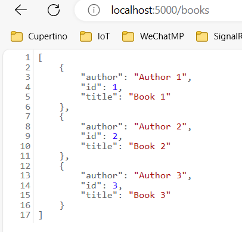
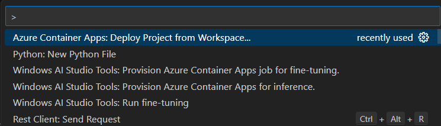
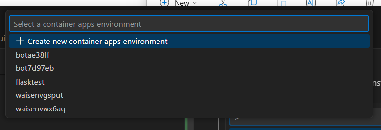
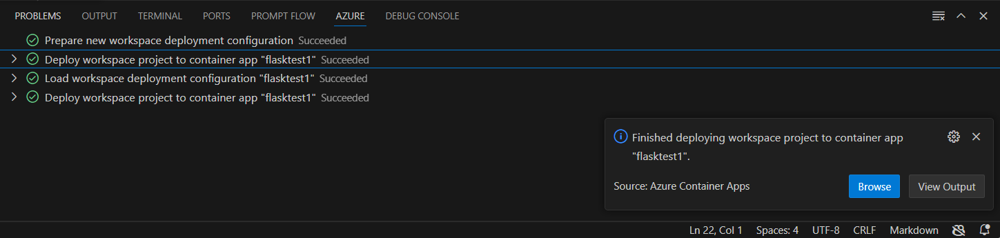
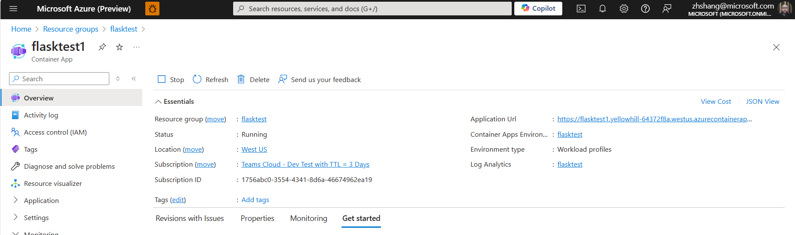
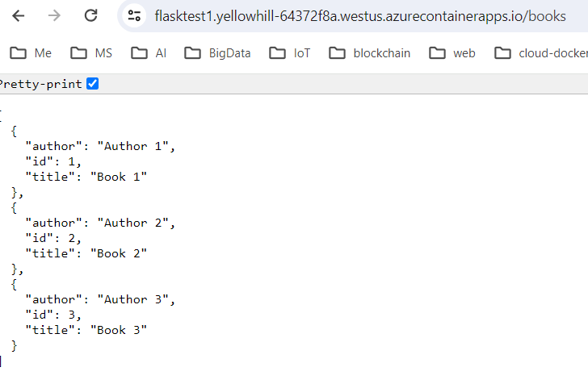

# flasktest

# local F5

Have Python extension installed. F5 and pick Flask. The test REST API runs at https://localhost:5000 

# Code to ACA

Have Azure Container Apps extension installed.
Now from Command Palette to run "Azure Container Apps: Deploy Project from Workspace"

Choose proper Azure subscription (It may ask you to sign in Azure first)
create a new or pick existing ACA environment

Give it a unique name, then wait until the process done. You will see the status like this:

Click blue button and follow the instruction to open the deployed URL on ACA.

Or go to Azure Portal, find the ACA deployed "Application URL"

Now fire up browser and run an API <Application URL>/books, it should show:

Now it is running in the cloud from ACA!