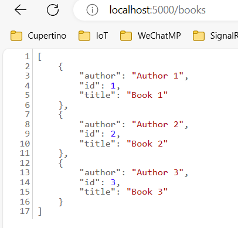
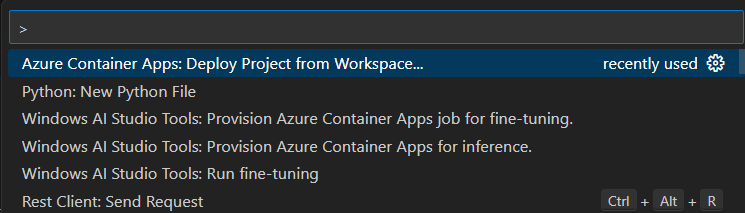
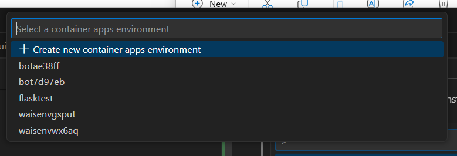
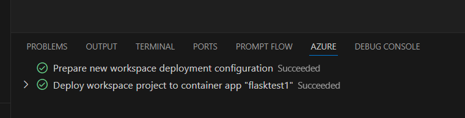

# flasktest

# local F5

Have Python extension installed. F5 and pick Flask. The test REST API runs at https://localhost:5000 

# Code to ACA

Have Azure Container Apps extension installed.
Now from Command Palette to run "Azure Container Apps: Deploy Project from Workspace"

Choose proper Azure subscription (It may ask you to sign in Azure first)
create a new or pick existing ACA environment

Give it a unique name, then wait until the process done. You will see the status like this:

